# DataWeaver.AI Data Flow Diagram

## High-Level Architecture


## User Interaction Flow

```mermaid
sequenceDiagram
    participant U as User
    participant F as Frontend
    participant B as Backend
    participant D as Database
    participant S as Storage
    
    U->>F: Upload Files
    F->>B: POST /api/files/upload
    B->>S: Store Files
    B->>D: Save File Metadata
    B->>F: Return File IDs
    F->>U: Show Upload Success
    
    U->>F: "Merge the files"
    F->>B: POST /api/intelligent-merge/execute
    B->>D: Get File Data
    B->>B: Analyze & Merge
    B->>S: Store Result
    B->>D: Save Workflow
    B->>F: Return Merged Data
    F->>U: Display Results
```



## Data Processing Pipeline


## State Management Flow


## API Communication Flow

```mermaid
graph LR
    subgraph "Frontend API Layer"
        A[api.ts]
        B[bioMatcherApi]
        C[dataQaApi]
        D[generalChatApi]
    end
    
    subgraph "Backend API Routes"
        E[/api/files]
        F[/api/intelligent-merge]
        G[/api/data-qa]
        H[/api/workflows]
        I[/api/general-chat]
    end
    
    subgraph "Backend Services"
        J[IntelligentMerger]
        K[DataQAService]
        L[FileService]
        M[WorkflowService]
    end
    
    A --> B
    A --> C
    A --> D
    
    B --> E
    B --> F
    C --> G
    D --> I
    
    E --> L
    F --> J
    G --> K
    H --> M
    I --> K
```

## Database Schema Flow


## Error Handling Flow


## Performance Monitoring Flow


## Security Flow


## Session Management Flow


This visual documentation provides a clear understanding of how data flows through the DataWeaver.AI application, making it easier for developers to understand the system architecture and data processing pipeline. 